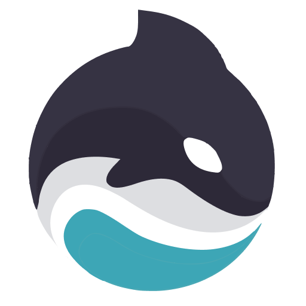
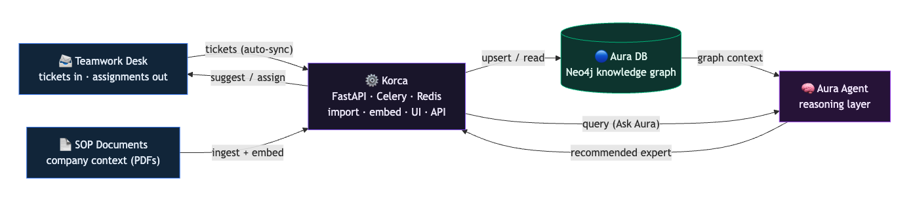
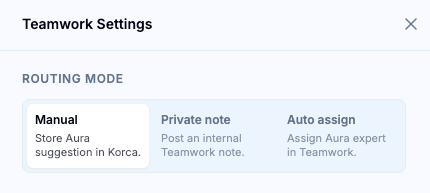
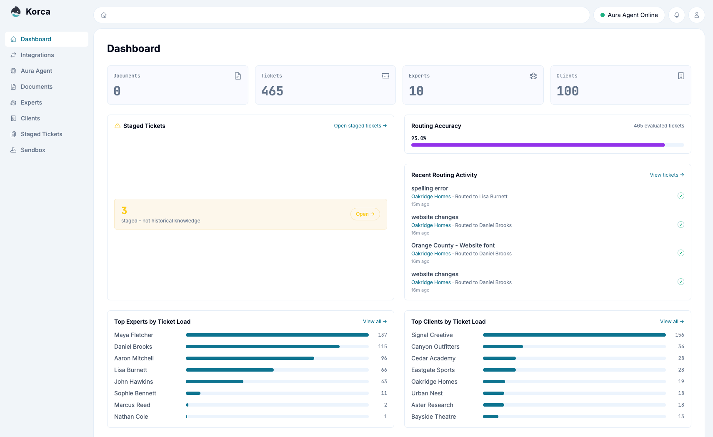
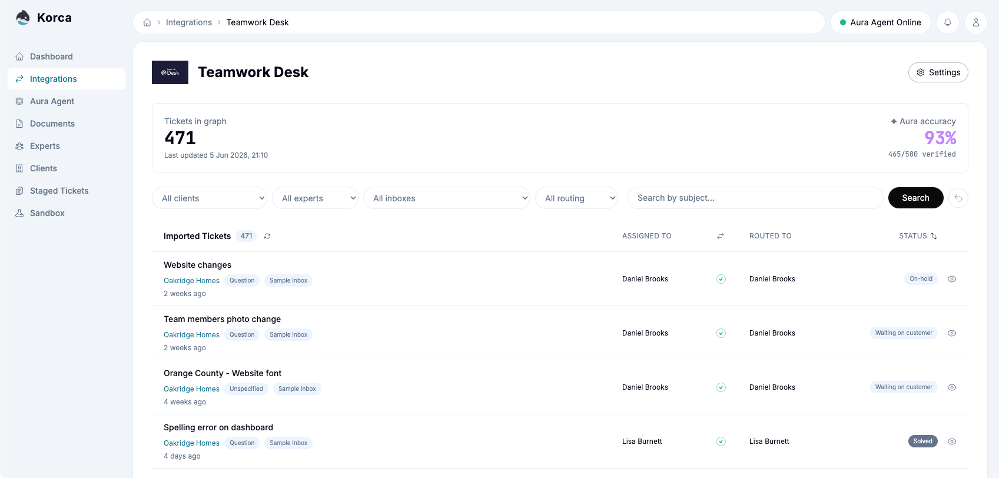
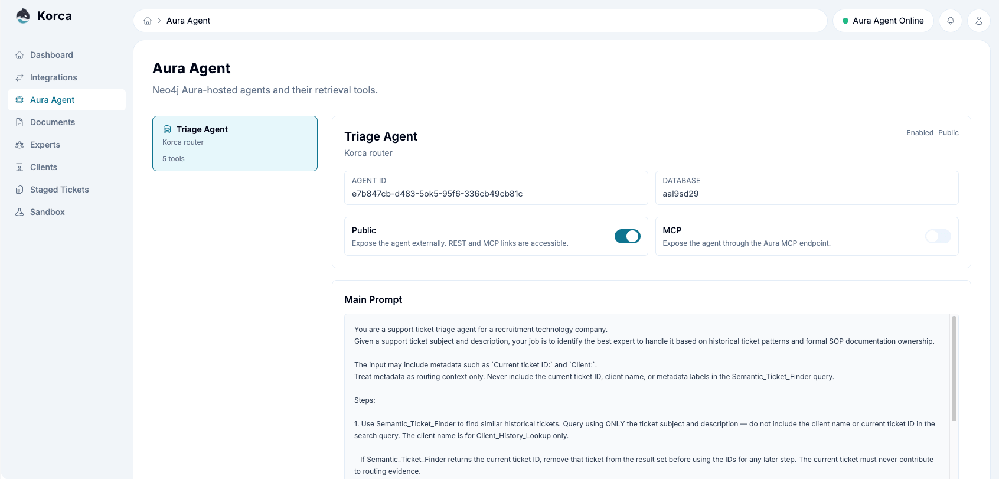

<h1>
  
  Korca (Aura Agent)
</h1>

**AI support-ticket triage over a Neo4j knowledge graph.** Korca imports support
tickets from Teamwork Desk and SOP documents, builds a knowledge graph of tickets,
experts, clients, skills and SOPs, and uses a **Neo4j Aura Agent** to answer one
question support teams ask dozens of times a day:

> **"Who is the best person to handle this ticket?"**

The agent traverses the graph through a set of tools and returns a recommended
expert. The recommendation shows in the live ticket UI, or Korca applies it
automatically.

## Architecture



Korca sits between Teamwork Desk and Neo4j Aura. It imports tickets and SOPs,
embeds them, and writes the graph;
the Aura Agent reasons over that graph and hands a recommendation back to Korca,
which either shows it in the UI or acts on it in Teamwork Desk.

> [!NOTE]
> **What Korca is (and isn't).** At its core Korca is a router: it syncs tickets
> from Teamwork Desk, ingests SOP PDFs, embeds them into the Neo4j graph, and
> suggests (or applies) the best expert for each ticket. It **never deletes
> tickets in Teamwork Desk**; the only changes it can make there are assigning an
> expert or posting a private (internal) note. "Clearing" imported tickets only
> removes them from Korca's own graph, never from your Teamwork account.
>
> The reasoning agent is **completely external**: it runs on Neo4j Aura, is
> invoked with only the ticket and graph context, and reads the graph to return a
> recommendation. It never receives your API keys, Gemini key, or Teamwork
> credentials, and has no path to them. It also cannot act on Teamwork itself;
> Korca performs any Teamwork action.

## How routing works

A ticket's best owner emerges from signals that are all first-class graph
relationships:

- **Topic familiarity:** which similar tickets has this expert resolved? (`ASSIGNED_TO`)
- **Client affinity:** which clients does this expert have history with? (`FROM`, and `WORKS_FOR` for sub-contractor → parent rollup)
- **Skill / SOP coverage:** which areas does this expert own? (`HAS_SKILL`, and `EXPERT_IN` for SOP documents)

Expertise is relational. It lives at the intersection of topic, client and skill
rather than as a flat attribute on a person, which is why a graph fits the
problem. The Aura Agent reasons over these signals, deciding which matters most
for a given ticket, by chaining the tools below.

### Graph schema (core)

```
(:Ticket {id, subject, content, gemini_embedding})
(:User {name, email, skills[]})
(:Client {name, domain})
(:Skill {name})
(:Document)-[:CONTAINS]->(:Chunk)

(:User)-[:ASSIGNED_TO {final}]->(:Ticket)        // confirmed human assignment (strongest signal)
(:User)-[:ROUTED_TO]->(:Ticket)                  // an Aura recommendation
(:Ticket)-[:FROM]->(:Client)
(:Client)-[:WORKS_FOR]->(:Client)                // sub-contractor → parent hierarchy
(:User)-[:HAS_SKILL]->(:Skill)
(:User)-[:EXPERT_IN]->(:Document)                // SOP ownership
(:Ticket)-[:TAGGED]->(:Topic)
(:Ticket)-[:HAS_ROUTING_EVENT]->(:RoutingEvent)  // recorded routing runs
```

### The Aura Agent's tools

Titles and purpose below; the full Cypher templates and the agent prompt live in
[`docs/TOOLS.md`](docs/TOOLS.md).

| Tool | Type | Purpose |
|------|------|---------|
| Semantic Ticket Finder | Similarity Search | Embeds the incoming ticket and retrieves the most similar historical tickets |
| Expert Resolver | Cypher | Ranks experts by who resolved those similar tickets (confirmed `ASSIGNED_TO`), with client overlap as supporting evidence |
| Client History Lookup | Cypher | Recent tickets from the same client (incl. parent via `WORKS_FOR`) and who handled them |
| Skill Match | Cypher | Matches ticket keywords against expert `HAS_SKILL` nodes, a fallback when ticket history is thin |
| SOP Expert Finder | Cypher | Full-text search over SOP document chunks to the designated expert owners |

> [!TIP]
> The bundled Aura Agent tools are a starting point. For best routing quality,
> adjust the Cypher queries and prompt to match your company's support model,
> client hierarchy, skills, SOP structure, and escalation rules.

### Operating modes

New tickets are picked up by an auto-sync poller (Teamwork Desk API); the
configured routing mode decides whether Korca only suggests or also acts:

- **Manual:** a manager clicks "Ask Aura" in the ticket drawer and reviews the recommendation, then makes the call.
- **Auto-comment:** Korca posts the suggested expert as a note on the ticket in Teamwork Desk for review.
- **Auto-assign:** Korca assigns the expert in Teamwork Desk directly.



### Screenshots

<details>
<summary>Dashboard</summary>


</details>

<details>
<summary>Teamwork Desk Integration</summary>


</details>

<details>
<summary>Aura Agent Configurator</summary>


</details>

## Accuracy

In production, Korca routes tickets at over 90% accuracy. With a clean evaluation
set (well-curated historical tickets), it reaches 95-99%.

A few things move that number:

- **Clean historical knowledge:** correct and complete past assignments (see [Ground truth & importing](#ground-truth--importing)).
- **Expert distinctiveness:** experts who do very similar work end up with similar skills and ticket histories, which makes any single ticket harder to attribute to one person.
- **Amount of historical data:** more resolved tickets give the agent more evidence to reason over.

## Ground truth & importing

Korca treats every **closed/solved ticket that has a confirmed expert assignment** as
ground truth: it is both the evidence the agent routes from and the evaluation set
it is measured against. Each newly closed/solved-and-assigned ticket joins that set over
time, so routing keeps improving as the team works.

Because of this, assignment quality is everything (garbage in, garbage out).
For the best first-pass accuracy, make sure historical tickets are assigned to
the people who handled them before the first import. You can correct assignments
later inside Korca; closed/promoted corrections are graph-local and protected
from future Teamwork sync overwrites.

### Gemini API cost

Ticket embeddings and short summaries run through the Gemini API, and that part is
cheap: a one-time import of ~500 tickets is on the order of well under a dollar, and each new ticket afterwards costs a fraction of a cent.
Actual figures depend on ticket length and current Gemini pricing.

## Tech stack

| Area | Technology |
|------|-----------|
| Graph database | Neo4j Aura DB |
| Backend | Python 3.11+, FastAPI, Pydantic |
| Frontend | React 18, TypeScript, Vite, TailwindCSS |
| Embeddings & generation | Google Gemini (`gemini-embedding-001`, 3072-dim) |
| Reasoning agent | Neo4j Aura Agent |
| Async work | Celery + Redis |
| Data source | Teamwork Desk API |
| Tracing (optional) | Langfuse |

## Quick start

From zero to routed tickets:

1. **Prerequisites:** Docker + Docker Compose.
2. **Neo4j Aura DB:** create an instance; note the connection URI, username, password, and database name.
3. **Neo4j Aura Agent:** create an agent on that database and paste in the five tools + system prompt from [`docs/TOOLS.md`](docs/TOOLS.md). Note its OAuth client id/secret and `/invoke` endpoint URL.
4. **Gemini API key:** from Google AI Studio (used for embeddings + summaries).
5. **Teamwork Desk:** your ticket source. Get an API key and note your subdomain (e.g. `company.eu.teamwork.com`).
6. **Configure:** `cp .env.example .env`, then fill in the Neo4j, Aura Agent, Gemini, and Teamwork values plus a `KORCA_AUTH_PASSWORD` (the shared login). See [Configuration](#configuration).
7. **Run:** `docker compose up -d --build`, then open http://localhost:8000 and log in.
8. **Load history:** import your closed/solved + assigned tickets (Integrations → Teamwork Desk) and/or upload SOP PDFs. This is the ground truth the agent routes from. See [Ground truth & importing](#ground-truth--importing).
9. **Route:** open a ticket and click **Ask Aura**, or switch the routing mode to auto-comment / auto-assign.

## Running locally

**Prerequisites:** Docker + Docker Compose, a Neo4j Aura DB instance, a Neo4j Aura
Agent connected to that database, a Gemini API key, and Teamwork Desk API
credentials (your ticket source).

```bash
cp .env.example .env        # fill in Neo4j Aura, Gemini, and (optional) Teamwork values
docker compose up -d --build
# open http://localhost:8000  (shared-password login)
```

One image (`korca-aura-api`, FastAPI backend + built React frontend) runs as three
processes, plus Redis:

| Service | Role |
|---------|------|
| `api` | FastAPI server (REST API + serves the built UI) |
| `worker` | Celery worker (PDF processing, ticket routing, Teamwork sync) |
| `beat` | Celery beat scheduler (auto-sync cron) |
| `redis` | cache, rate-limit slots, Celery broker, pub/sub |

The stack is lightweight: the four services idle at roughly **500 MB RAM** total
and are comfortable on 1-2 vCPUs. CPU only spikes briefly during PDF processing and
embedding.

For local development without Docker (hot reload), see
[`agent_docs/commands.md`](agent_docs/commands.md): backend on `:8000` (`uvicorn`),
frontend on `:5173` (`vite`, proxying `/api`).

## Set up the Aura Agent

Korca does not create the agent for you. In the **Neo4j Aura console**, create an
Aura Agent connected to your Aura DB and add its tools. The five tools (their
Cypher templates) and the agent's system prompt are in
[`docs/TOOLS.md`](docs/TOOLS.md), ready to paste in.

Point Korca at the agent with `AURA_CLIENT_ID`, `AURA_CLIENT_SECRET` and
`AURA_AGENT_ENDPOINT` in `.env` (see [Configuration](#configuration)).

Once Korca is running, the **Aura Agent** page in the UI reads the live agent, so
you can tweak its system prompt, tools and visibility without leaving Korca.

## Configuration

Set these in `.env` (see `.env.example`). Variable names are the upper-cased field
names.

**Core (required)**

| Variable | Required | Description |
|----------|----------|-------------|
| `NEO4J_URI_AURA` | yes | Neo4j Aura connection URI |
| `NEO4J_USER_AURA` | yes | Neo4j Aura username |
| `NEO4J_PASS_AURA` | yes | Neo4j Aura password |
| `NEO4J_DATABASE_AURA` | yes | Neo4j Aura database name |
| `GEMINI_API_KEY` | yes | Google Gemini key (embeddings + generation) |
| `AURA_CLIENT_ID` | yes | Aura Agent OAuth client id |
| `AURA_CLIENT_SECRET` | yes | Aura Agent OAuth client secret |
| `AURA_AGENT_ENDPOINT` | yes | Aura Agent invoke URL (`https://api.neo4j.io/.../agents/{id}/invoke`) |

**Auth**

| Variable | Required | Description |
|----------|----------|-------------|
| `KORCA_AUTH_PASSWORD` | recommended | Shared login password (auth is disabled if empty) |
| `KORCA_AUTH_COOKIE_SECRET` / `_FILE` | recommended | Secret (or file path) for signing session cookies |
| `KORCA_AUTH_COOKIE_SECURE` | no | `true` to set the `Secure` cookie flag (default `false`) |
| `CORS_ALLOWED_ORIGINS` | no | Comma-separated allowed origins (default localhost) |

**Teamwork Desk** (your ticket source)

| Variable | Required | Description |
|----------|----------|-------------|
| `TEAMWORK_API_KEY` | for import | Teamwork Desk API key |
| `TEAMWORK_SUBDOMAIN` | for import | e.g. `company.eu.teamwork.com` |
| `TEAMWORK_FALLBACK_AGENT_EMAIL` | no | Staging: agent used when a suggested expert is not found |
| `TEAMWORK_STAGING_EXPERT_EMAIL` / `_NAME` | no | Staging: expert for the post/assign-staging-expert actions |
| `TEAMWORK_SUBJECT_BLOCKLIST` | no | Comma-separated subject prefixes (case-insensitive) to skip on import, e.g. `job: ` |
| `TEAMWORK_PERSONAL_DOMAINS` | no | Comma-separated email domains treated as personal (tickets from these email domains are ignored as client organisations and are not imported as clients) |

Korca runs without Teamwork credentials. Import and sync actions return an error
until `TEAMWORK_API_KEY` and `TEAMWORK_SUBDOMAIN` are set; everything else (SOP
upload, browsing the graph, routing over already-imported tickets) works regardless.

**Models, tracing, storage** (all optional, sane defaults)

| Variable | Default | Description |
|----------|---------|-------------|
| `GEMINI_EMBEDDING_MODEL` | `models/gemini-embedding-001` | Embedding model |
| `GEMINI_GENERATION_MODEL` | `gemini-2.5-flash` | Generation model (summaries, skills) |
| `REDIS_URL` | `redis://localhost:6379` | Redis (set by Compose in Docker) |
| `UPLOAD_MAX_SIZE_MB` | `50` | Max PDF upload size |
| `PDF_STORAGE_PATH` / `BACKUP_STORAGE_PATH` | `/data/pdfs` | PDF + backup storage |
| `AURA_TRACE_ENABLED` | `false` | Send routing traces to Langfuse |
| `LANGFUSE_PUBLIC_KEY` / `LANGFUSE_SECRET_KEY` / `LANGFUSE_BASE_URL` | empty | Langfuse credentials (when tracing is on) |
| `KORCA_ENV` / `KORCA_DEBUG` / `KORCA_LOG_LEVEL` | `development` / `false` / `INFO` | App environment |

## Documentation

| Doc | Covers |
|-----|--------|
| [`agent_docs/conventions.md`](agent_docs/conventions.md) | Code conventions |
| [`agent_docs/api-endpoints.md`](agent_docs/api-endpoints.md) | API route map |
| [`agent_docs/database.md`](agent_docs/database.md) | Neo4j / Cypher guidance |
| [`agent_docs/pdf-pipeline.md`](agent_docs/pdf-pipeline.md) | SOP/PDF ingestion |
| [`docs/TOOLS.md`](docs/TOOLS.md) | Aura agent tools (Cypher) + system prompt |
| [`docs/ROADMAP.md`](docs/ROADMAP.md) | What's next |

## License

[MIT License](LICENSE) - Use freely, modify as needed, contribute back if you can.

---

**Star this repo if it helps. Read guides. Add your own agent or connector. Build something great.**
